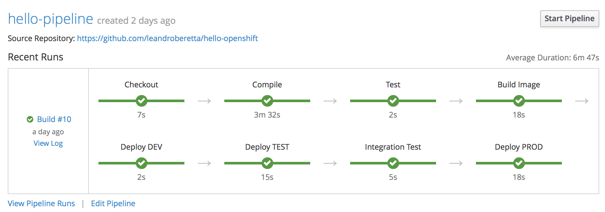

# hello-openshift

A hello world pipeline example for OpenShift.

## Requisites

* An **OpenShift** cluster (3.7 or higher)
* The **OpenShift** CLI client (**oc**)

## Usage

See the **provision.sh** script file and then run it.

    sh provision.sh

The script will create 3 projects (environments):

* hello-dev
* hello-test
* hello-prod

The **Jenkins** which orchestrates the deployments is deployed in the **hello-dev** project.

Check the **Jenkinsfile** for the pipeline execution details.