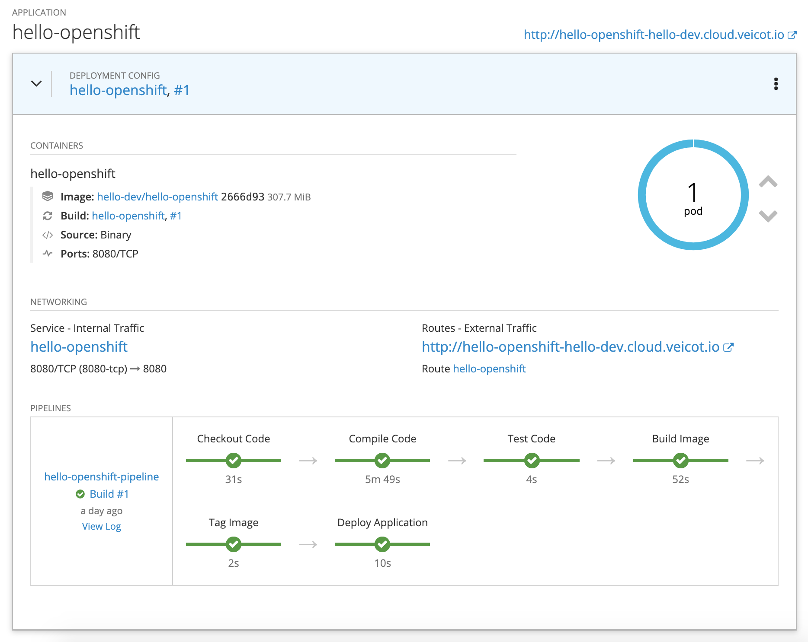

# Hello OpenShift

Hello World application to demonstrate OpenShift concepts and Jenkins pipelines.

## Usage

    oc new-project hello-dev

    Now using project "hello-dev" on server "https://cloud.veicot.io:8443".

    You can add applications to this project with the 'new-app' command. For example, try:

        oc new-app centos/ruby-25-centos7~https://github.com/sclorg/ruby-ex.git

    to build a new example application in Ruby.

    oc new-app -f hello-openshift.yaml

    --> Deploying template "hello-dev/hello-openshift" to project hello-dev

        * With parameters:
            * Application Name=hello-openshift
            * Git Repository=https://github.com/leandroberetta/hello-openshift.git
            * Git Branch=master

    --> Creating resources ...
        buildconfig "hello-openshift-pipeline" created
        imagestream "hello-openshift" created
        buildconfig "hello-openshift" created
        deploymentconfig "hello-openshift" created
        service "hello-openshift" created
        route "hello-openshift" created
    --> Success
        Use 'oc start-build hello-openshift-pipeline' to start a build.
        Use 'oc start-build hello-openshift' to start a build.
        Access your application via route 'hello-openshift-hello-dev.cloud.veicot.io'
        Run 'oc status' to view your app.

## Overview

